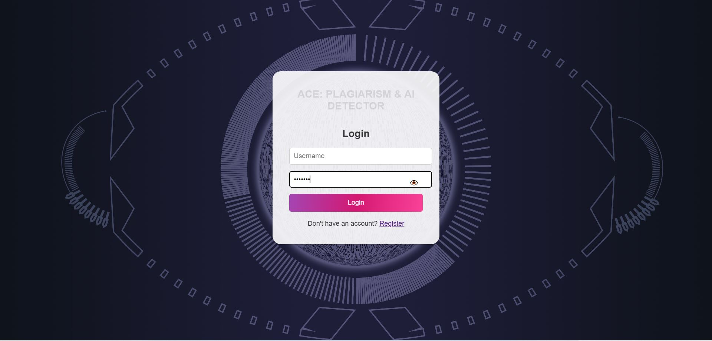
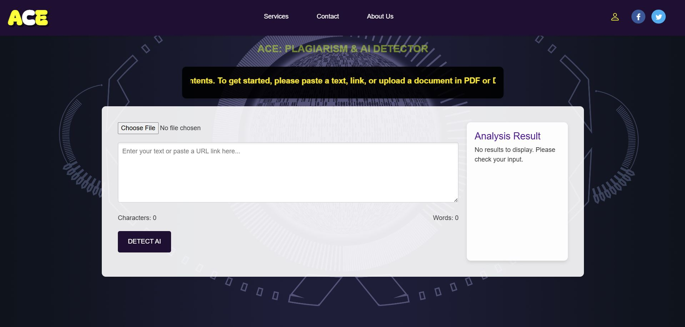

# 🧠 Ace AI Detection Website

This web application is designed to detect whether a given text is AI-generated or human-written using a trained machine learning pipeline. It also includes features to extract text from documents (PDF/DOCX) and URLs for detection.

## 🚀 Features

- 🔍 AI-generated text detection using a trained model (`pipeline_model.pkl`)
- 📄 Upload and analyze PDF or Word documents
- 🌐 Extract and evaluate text directly from URLs
- 🔐 User authentication (login, register)
- 📊 Probability score with classification (`AI-generated` or `Human-written`)

## 🖼️ Screenshots

Preview of ACE from login to Dashboard:

📌 Dependencies
Flask
Flask-Login
SQLAlchemy
Pandas
scikit-learn
joblib
BeautifulSoup4
PyPDF2
python-docx

